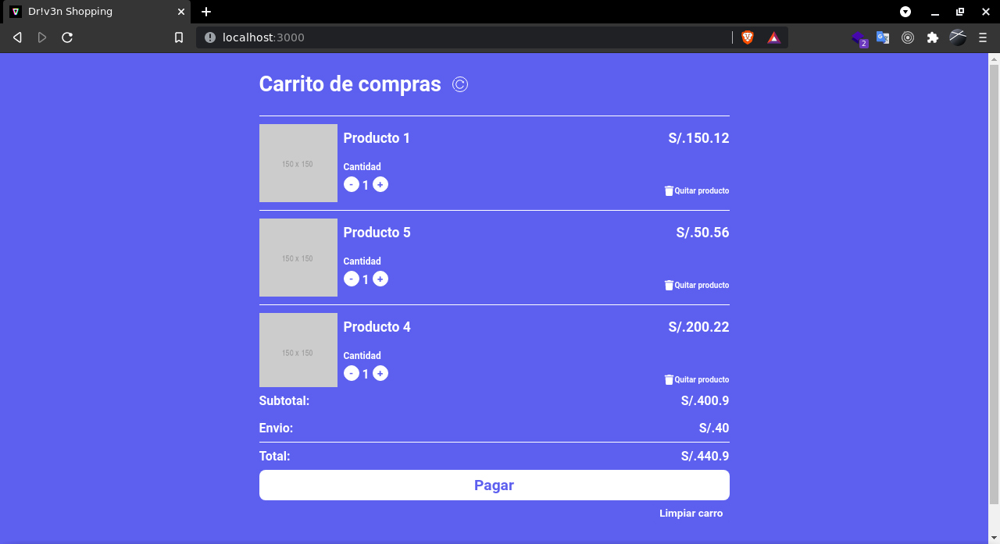

# Driven Challenge

Proyecto para mi proceso de selección para Driven

- Construido sobre CRA (Create React App).
- Este es el [Figma] (https://www.figma.com/file/QHnf0LnDQPq4EVXK7YcCKl/Driven---Challenge?node-id=0%3A1).
- Deploy en Vercel en este [link] (https://driven-test.vercel.app/).

Saludos!

-----

## Respuesta:
Hola Darwin, lamentablemente no pasaste la valla que nos propusimos. Sin embargo te enviamos la retroalimentación sobre tu reto para que puedas seguir puliendo tus habilidades. ¡Te deseamos el mejor de los éxitos!

### A favor:
- Usa el API.
- El desarrollo esta dividido en componentes.
- Usa git e hizo más de 1 commit.

### En contra:
- No hay una buena estructura de proyecto.
- Hay demasiada granularidad en los componentes.
- El diseño varía demasiado del requerimiento.
- Los subComponentes se encargan de modificar la data del estado principal.
- Cuenta con lógica que no se pidió en el ejercicio y no tiene aparente valor agregado.
- Carga varias fuentes de roboto, pero no se implementan correctamente.
- No hay pruebas unitarias, pese a que tiene jest en el proyecto.

## Me: 
Antes de comentar mi apreciación de los puntos en contra de mi evaluación punto por punto me gustaría comentar que aunque el ejercicio se planteó para una semana resolví CADA requerimiento especificado en menos de un día. 
Sin embargo, he notado que me han evaluado por puntos que no sabía que iba a ser evaluados. Me da a entender que consideran que son puntos implícitos que todo programador debe hacer, pero... ¿en serio hubiera sido algo malo no comentarlo en la definición del ejercicio? La única forma que puedo entender el porqué no lo mencionaron sería para evaluar si tengo conocimiento de la existencia de esos puntos (los patrones, la arquitectura, herramientas de desarrollo y flujo), pero eso pudo haberse hecho en un test de 5 preguntas previa como paso previo a un reto técnico de desarrollo. Si no fue con esa intención entonces... ¿por qué no lo definieron? 😥 Me hubiera gustado tener la oportunidad de saber qué querían con exactitud para darles eso.

¿Cómo decidí avanzar con el proyecto?
- Boilerplate que todo el mundo conoce: CRA (Create React App). Me pareció más fácil comenzar con CRA en vez de preparar uno con Webpack o Esbuild (mi favorito), por ejemplo. Me pareció que no habría problemas con eso ya que me pareció que lo aceptarían porque no tenían problema con que usen una librería de componentes como MaterialUI, Ant Design u otros.
- Hacer como mínimo lo que piden para pasar la prueba: CRUD local con data inicial de la API y que el diseño sea el mismo que el del Figma. Aunque acá hice unos detallitos más que me parecieron imprescindibles para que el usuario no se sienta perdido al llegar hasta cierta parte del flujo del UX, como no estaba definido en el mockup y ni mencionar que no había el prototipo.

Ahora sí... mis puntos en contra.

- No hay una buena estructura de proyecto: (discutible, pero lo puedo aceptar :( )
Admito que no consideré la estructura del proyecto como algo fundamental ya que era un requerimiento tan mínimo. Básicamente sólo se especificó que debe ser un CRUD local con data inicial de la API y que el diseño sea el mismo del FIGMA.

- Hay demasiada granularidad en los componentes: (extrañado, agradecería aclaración)
No estoy seguro de a qué se refiere exactamente. Supongo que se refiere a que está mal mucha subdivisión en componentes. Quizá me equivoque porque hasta donde sé lo anterior se considera buena práctica, especialmente para proyectos pequeños y medianos. Agradecería mucho que me lo aclaren.

- El diseño varía demasiado del requerimiento. (en desacuerdo, sorprendido)
Esto sí me sorprendió bastante, en serio me parece que el diseño es indistinguible del FIGMA.

- Los subComponentes se encargan de modificar la data del estado principal. (considerable)
No me pareció crítico a considerar, pero en retrospectiva y con la aclaración en su respuesta que la arquitectura del proyecto era algo importante a considerar entonces supongo que sí debí haberlo manejado de otra forma para quizá no contaminar tanto los subcomponentes. Definir el manejo del estado global en una sección aparte como se suele hacer con redux, luego definir hooks o simple funciones que usen los dispatch para no usarlo directamente en la función del componente. Y, aunque quizá esté demás decirlo, implementar eso último en Los subComponentes, porque es inevitable, a mi apreciación, que no sea así. Pero si me equivoco me gustaría más detalles por favor.

- Cuenta con lógica que no se pidió en el ejercicio y no tiene aparente valor agregado. (sorprendido, no sé cuál es, porque las que agregué si me parecían que tiene valor agregado aunque no esperaba que resulte en contra)
El ejercicio no considera cada caso de uso del usuario ya que no hay una respuesta definida para: ¿qué pasa cuando el usuario haga click en pagar?, ¿cómo debe comportarse si hubiera habido muchos productos, tantos que hubiera existido un scroll vertical? ¿cómo debe comportarse y verse si el usuario trata de comprar agregar más productos de los que existen en stock (amount)? No recuerdo si había más, pero estos son los que recuerdo y los que me pareció adecuado resolver usando lógica adicional. Claro, no esperaba que me cuente esto a favor, pero esperaba al menos que no cuente como en contra. Ahora, si la lógica que refieren que implementé y que no tiene valor agregado no son los que hice para que resolviera lo anterior mencionado, entonces... ¿podrían indicarme cuáles son, por favor?

- Carga varias fuentes de roboto, pero no se implementan correctamente. (Okey... I guess...)
Si el problema es que agrega más peso (aunque es casi nada) al proyecto (aproximadamente 170 kb por cada uno) entonces sí, lo acepto: ¡Mi descuido, mi error!
Aunque... no importaría nada en producción ya que al hacer el build las fuentes que no se usan no se aparecería en el build. 

- No hay pruebas unitarias, pese a que tiene jest en el proyecto. (Es un boilerplate, no parece grave como para ser un punto en contra)
Si no se especificó el boilerplate que se iba a usar entonces decidí usar el de uso más común: Create React App, boilerplate de Facebook. Este boilerplate trae varios módulos por defecto por si el programador lo desea llegar a usar y si no lo usa pues no parece problema (¿más espacio en node_modules? es ínfimo, otra vez: no aparece en producción). Además, el boilerplate también tiene código para implementar una PWA. que también es código muerto si no se usa, pero no está mal dejarlo ahí por si plantea usarse durante la marcha. Parece el mismo caso que el de Jest, pero no lo consideran como algo en contra, supongo, porque no lo han comentado.

En serio agradezco que se hayan tomado el tiempo para darme ese feedback, me han dado mucho en qué pensar y analizar.
AGRADECERÍA INFINITAMENTE que me compartieran el test técnico del candidato que pasó para tenerlo como referencia más exacta o al menos que me aclaren los puntos en contra en función de mis apreciaciones anteriores.

Desde ya, muchas gracias y mil perdones por todo esto. Estoy dispuesto a trabajar con ustedes bajo cualquier condición remunerativa que ustedes propongan. Me parece un equipo agradable en el que puedo aprender mucho y desarrollarme profesionalmente mucho más.

Saludos,
[Esperando respuesta. EN verdad quiero ingresar a Driven :'( ]
